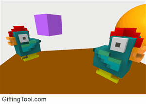

About Me
-----
I have been interested in technology since my early youth when my dad purchased a subscription to <a href="http://www.popsci.com/" target="_blank">Popular Science Magazine</a> for my brother and me.  I remember imagining how cool the world would be when scientists could make the machines and computers they were designing.  Fast forward a decade later, and I was building my first computer with an Intel Pentium III 500MHz Processor.  In 1996, I got the itch for coding by making fan websites for bands and starting an online magazine.  I recall how exciting it was to see my code trigger a song to play within a webpage for the first time.

A nerd was born.

I decided to pursue a Computer Science degree at California State University, Chico, where I continued to build and repair computers as part of the Information Technology Support staff. After graduating from college, I worked as a Software Engineer at Chevron, AT&T, and Comcast.  I now have the taste of developing and deploying applications to 30+ million users across the United States and am hungry to do more.

I have moved into Product Management from the role of Engineering Manager, and I love it!  I enjoy being hands-on technically with designing and coding and working toward a common vision with my team members.

When I am not coding or doing research, you can find me hanging out with my wife or out mountain biking, shooting photos, reading, or hunting for the perfect cup of coffee.

If you have an exciting start-up, project or role that you feel I would be interested in, feel free to contact me immediately through my <a href="http://www.linkedin.com/in/kirkkohler" target="_blank">LinkedIn</a> profile. Otherwise, follow me through my various social networks, such as <a href="https://twitter.com/kirkkohler" target="_blank">Twitter</a> or my <a href="https://medium.com/digital-cake" target="_blank" title="Kirk's Blog">blog</a>. 

Angel investments can be found on <a href="https://angel.co/u/kirk-kohler" target="_blank">AngelList</a>.

Archived Projects
-----
<ul>
    <li><a href="http://cvrnt.com/" target="_blank">CVRNT Podcast</a> - (pronounced current) is a podcast/blog about the latest and greatest in Virtual Reality with some rife speculation. Subscribe at <a href="https://itunes.apple.com/us/podcast/cvrnt/id1167903953" target="_blank">iTunes</a>, <a href="https://play.google.com/music/m/Iqphq5drczoca63dip4wu5wdr6u?t=CVRNT_A_Virtual_Reality_Podcast_For_Your_Entertainment" target="_blank">Google Play</a> or wherever you listen to podcasts. Follow us on Twitter: <a href="https://twitter.com/cvrnt" target="_blank">@cvrnt</a>, <a href="https://www.youtube.com/channel/UCJqaCttI5biychf7UZirOnA" target="_blank">Youtube</a>, <a href="https://www.instagram.com/cvrntpodcast/" target="_blank">Instagram</a> and <a href="https://www.facebook.com/cvrntpodcast/" target="_blank">Facebook</a></li>
    <li><a href="http://vrnear.me/" target="_blank">VR Near Me</a> - A website where people can find the most exciting virtual reality locations.</li>
    <li><a href="https://kirkkohler.github.io/vrChicken/" target="_blank">vrChicken</a> - A Virtual Reality prototype with chicken <a href="https://ephtracy.github.io/" target="_blank">Voxel models</a> supported on mobile platforms using <a href="https://aframe.io/" target="_blank">A-Frame</a>, a WebVR framework.
         </li>
    <li><a href="http://www.meetup.com/Eastside-Virtual-Reality-Meetup/" target="_blank">Eastside Virtual Reality Meetup</a> - A meetup for VR enthusiasts Eastside of Seattle. Follow us on Twitter: <a href="https://twitter.com/esidevr" target="_blank">@esidevr</a>, <a href="https://www.youtube.com/channel/UCBUfVuqFaxoFNUgttW2kf6g" target="_blank">Youtube</a> and <a href="https://www.facebook.com/esidevr/" target="_blank">Facebook</a></li>
    <li><a href="http://devpost.com/software/bimvar" target="_blank">BIMVAR</a> - At a Virtual Reality Hackathon, my team built a collaborative system allowing many users to analyze, and mark BIM clashes within a virtual space with head, hand tracking and voice support.
    <iframe width="100%" height="315" src="https://www.youtube.com/embed/S5yNC-MGN0U" frameborder="0" allow="accelerometer; autoplay; encrypted-media; gyroscope; picture-in-picture" allowfullscreen></iframe></li>
    <li><a href="http://outwestoutdoors.tv" target="_blank">Out West Outdoors</a> - A videography site exploring hunting and fishing in Northern California</li>
    <li><a href="https://twit-vizual.herokuapp.com" target="_blank">Twit Vizual</a> - A "MEAN" stack application, hosted on Heroku, which provides a RESTful API returning results from Twitter’s streaming service to a web application and visualizes the data using D3.js</li>
</ul>
